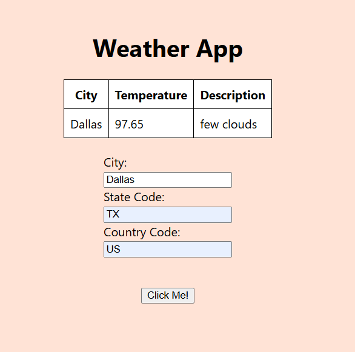

# Weather ETL data pipeline

## Desciption
This app uses a public weather api to provide a current forecast of a given location.



## Installation
To install please do the following:

1. Clone github repository
2. Go to Weather API website (https://openweathermap.org/) and create an account and api
3. Create a .env in the ./weather-app directory with the following code:
```
REACT_APP_API_KEY = YOUR_API_KEY
```
Replace YOUR_API_KEY with your new api from the website
4. Run your react app using the following commands:
```
npm install
npm start
```
5. In the website enter data into the form and submit for weather results
Example:
* City: Dallas
* State: TX
* Country: US